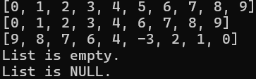

# Linked List API
This API provides a simple implementation of a doubly linked list with CRUD operations, making it easy to manipulate data in a list-based structure.

## This API provides
* Insertion
* Deletion
* Update
* Print List 
* Print in reverse
* Recursive print in reverse
* Reverse List
* Empty List 
* List deallocation / deletion

## Build
1. Clone the repository:
    ```
    git clone https://github.com/andreas-soteriou/dlinkedlist.git 
    ```
2. Modify the `Makefile` if necessary to fit your project structure. See also Makefile's description for more details.

2. Build the executable file by running the below command
    
    ```
    make
    ```
3. Use the below command to remove the object files and the executable file.
    ```
    make clean
    ```

## How to use the list structure 

1. Make sure to review the comments in include/dllist.h for detailed information on each operation.
2. Initialize list before calling any CRUD operations
3. Delete the list at the end of it's use, to prevent memory leaks.
5. Example code given:
    ``` c
    #include <stdio.h>
    #include "include/dllist.h"

    /* For simplicity the example handles integer data */
    /* Print element function */
    void print_element(void *element){
        printf("%d\n", *(int *)element);
    }
    
    /* Comparable function that compares if two elements are equal */
    int compare_elements(void *element1, void *element2){
        return (*(int *)element1 ==  *(int *)element2);
    }
 
    int main(){
        struct list *list =  NULL;
        // Initialize the list before any CRUD Operations
        init_list(&list, print_element, compare_elements);
        
        /* CRUD Operations */
        for (int i=0; i<10; i++){
            insert(list, &i, sizeof(int));
        }
        print(list);
        
        int remove = 5;
        remove_element(list, &remove);
        print(list);
        
        int dest = 3;
        int src = -3;
        replace(list, &dest, &src, sizeof(src));
        reverse(list);
        print(list);

        clear(list);
        print(list);
        // Deallocate the list at the end
        delete_list(&list);
        print(list);

        return 0;
    }
    ```
## Example Output 


*Visual representation of the doubly linked list structure after the operations are performed.*

## Ideas for the future
1. Allow storing any data type
2. Implement file stream api to store list in disk.
3. Sort list 
4. Retrieve element
5. Apply filtering or mapping 

## Disclaimer
This is by no means a perfect linked list data structure, and we welcome any improvements, as we are continuously working on enhancing it.
